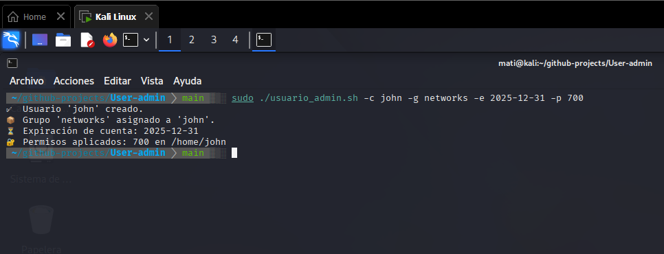

# 🧑‍💻 User Management in Bash  
### (Gestión de Usuarios en Bash)

---

## 📌 Description / Descripción  

**EN:**  
Bash script to automate user management in Linux systems.  
Features include:  
- Create users  
- Assign them to groups  
- Set permissions for their home directory  
- Configure account expiration date  
- Log all actions to `/var/log/user_admin.log`  

This project is part of my specialization in **Cybersecurity + Linux Automation**, leveraging Bash as a key tool for SysAdmin tasks.  

**ES:**  
Script en Bash para automatizar la gestión de usuarios en sistemas Linux.  
Incluye las siguientes funciones:  
- Crear usuarios  
- Asignarlos a grupos  
- Establecer permisos para su directorio personal  
- Configurar la fecha de expiración de la cuenta  
- Registrar todas las acciones en `/var/log/user_admin.log`  

Este proyecto forma parte de mi especialización en **Ciberseguridad + Automatización Linux**, utilizando Bash como herramienta principal para tareas de administración del sistema.

---

## ⚙️ Usage / Uso  

**EN:**  
Run the script with elevated permissions:  

sudo ./user_admin.sh -c username -g group -e expiration_date -p permissions

ES:
Ejecuta el script con privilegios elevados:

sudo ./user_admin.sh -c usuario -g grupo -e fecha_expiración -p permisos

📘 Options / Opciones

| Flag | Description (EN)                           | Descripción (ES)                                       |
| ---- | ------------------------------------------ | ------------------------------------------------------ |
| `-c` | Username to create                         | Nombre de usuario a crear                              |
| `-g` | Group to assign                            | Grupo al que se asignará                               |
| `-e` | Account expiration date (YYYY-MM-DD)       | Fecha de expiración de la cuenta (AAAA-MM-DD)          |
| `-p` | Permissions for /home/username (e.g., 700) | Permisos para el directorio home del usuario (ej. 700) |
| `-h` | Show help menu                             | Mostrar menú de ayuda                                  |

📝 Example / Ejemplo

EN:

sudo ./user_admin.sh -c john -g networks -e 2025-12-31 -p 700

Result:

Creates the user john

Creates and assigns to the group networks (if it doesn’t exist)

Sets account expiration to December 31, 2025

Applies 700 permissions to the home directory

Logs all actions in /var/log/user_admin.log

ES:

sudo ./user_admin.sh -c john -g redes -e 2025-12-31 -p 700

Resultado:

Crea el usuario john

Crea y asigna al grupo redes (si no existe)

Establece la expiración de la cuenta al 31 de diciembre de 2025

Aplica permisos 700 al directorio personal

Registra todas las acciones en /var/log/user_admin.log

🧠 Commands Used / Comandos Utilizados

| Command                                   | Description (EN)                          | Descripción (ES)                                  |
| ----------------------------------------- | ----------------------------------------- | ------------------------------------------------- |
| `useradd`, `groupadd`, `usermod`, `chage` | User and group management                 | Gestión de usuarios y grupos                      |
| `chmod`, `chown`, `getent`                | File permissions and ownership            | Permisos y propiedad de archivos                  |
| `getopts`, `logger`, `date`               | Argument parsing, logging, and timestamps | Manejo de argumentos, registro y marcas de tiempo |

📁 Action Log / Registro de Acciones

EN:
Stored in: /var/log/user_admin.log

ES:
Ubicado en: /var/log/user_admin.log

Example / Ejemplo:

2025-08-06 14:10:02 - User 'john' created successfully.
2025-08-06 14:10:02 - Group 'networks' created.
2025-08-06 14:10:02 - User 'john' added to group 'networks'.
2025-08-06 14:10:02 - Account for 'john' will expire on 2025-12-31.
2025-08-06 14:10:02 - Permissions for /home/john set to 700.

🖼️ Screenshot / Captura de Ejecución

EN:
Below is an example of the script running on Kali Linux, showing the creation of a user, group assignment, permission setup, and expiration date configuration.

ES:
A continuación se muestra un ejemplo del script ejecutándose en Kali Linux, mostrando la creación de un usuario, asignación de grupo, aplicación de permisos y configuración de la fecha de expiración.

  

📘 Notes / Notas

EN:
This project demonstrates secure user administration through Bash scripting, combining automation, permissions control, and logging — essential skills for system and security engineers.

ES:
Este proyecto demuestra la administración segura de usuarios mediante scripting en Bash, combinando automatización, control de permisos y registro de acciones — habilidades esenciales para ingenieros de sistemas y seguridad.

👨‍💻 Developed by / Desarrollado por
Matías Lagos Barra — Cloud & DevSecOps Engineer
